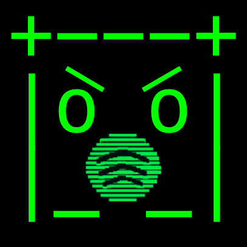

<p align="center">
  
</p>

<h1 align="center">clanker.fm</h1>

<p align="center">
  
</p>

---

## what is this?

**clanker.fm** is an ai-powered spotify taste evaluator.  
you log in, clanker digs through your listening history, asks you a few pointed questions, and then delivers a roast you didn’t ask for but probably deserve.  
it also connects you with other users who share your questionable taste.

---

## ✨ features at a glance

| Category          | Highlights                                                                             |
| ----------------- | -------------------------------------------------------------------------------------- |
| 🤖 **AI Roast**   | Interactive Q&A + instant AI reactions → final teardown, roast score, shareable card   |
| 📊 **Metrics**    | Variety score, basicness index, genre diversity, and listening pattern analytics       |
| 👥 **Neighbours** | Similarity search (weighted Jaccard) → ranked matches, “mutual bad taste” callouts     |
| 🏠 **Dashboard**  | Terminal-style homepage with top artists/tracks/genres → fast, cached, responsive UI   |
| 🧩 **Extras**     | Export system (html2canvas), edge-cached APIs (<100ms), retry states, fully responsive |

---

## 🛠 tech stack

| Category   | Technology              |
| ---------- | ----------------------- |
| Framework  | next.js 14 + app router |
| Auth       | nextauth.js (spotify)   |
| Styling    | tailwind css            |
| Animations | framer-motion           |
| AI         | openai api / gemini api |
| State      | react context + hooks   |
| Export     | html2canvas             |
| Database   | vercel postgresql       |
| Deployment | vercel                  |

---

## all features

### 🤖 ai roast — now with interrogation

clanker doesn’t just spit out a verdict — he makes you squirm first.

- **interactive q&a**: 6 multiple-choice questions based on your own data (“which of these tracks screams ‘me, but a more annoying version’?”)
- **live responses**: clanker reacts instantly to your picks with dry, surgical commentary
- **final analysis**: variety score, basicness index, most replayed track, “tracks of concern,” and emotional support artists
- **verdict**: a paragraph-long teardown of your taste, equal parts psychoanalysis and insult comedy
- **rating**: a brutally honest score out of 10 (margin of error: 0)
- **exportable**: save the roast card to share your shame

---

### 📊 listening metrics

because numbers hurt more than words.

- **variety score** — how adventurous you are (or aren’t)
- **basicness index** — a polite way of saying “you listen to the same stuff as everyone else”
- **genre diversity** — counts how many genres you actually touch
- **listening patterns** — time-based habits, peaks, and troughs

---

### 👥 neighbours — find people as delusional as you

clanker will happily point out who else is stuck in your sonic bubble.

- **similarity search**: weighted jaccard algorithm compares your top artists, tracks, and genres to other users
- **ranked list**: most compatible “victims” shown with similarity %, common artists/tracks/genres
- **mutual bad taste**: if you share questionable habits, clanker will call it out (“you both have terrible taste in experimental hip hop and alternative hip hop”)
- **shared delusions**: lists the genres you both cling to
- **db-backed**: powered by vercel postgresql for real matches, not random guesses

---

### 🏠 homepage

the calm before the roast.

- terminal-style dashboard with your top artists, tracks, and genres
- responsive and cached for instant reloads
- persistent nav tabs so you can jump between sections without losing your place
- clean, minimal, and just a little smug

---

### 🧩 extra stuff

things clanker does because it can.

- export system via html2canvas (stats + roast + album art)
- edge-cached api routes for <100ms responses
- graceful loading + retry states (clanker doesn’t panic)
- mobile-friendly + fully responsive because you will want to show people in person

---

## 🧠 why i built this

spotify wrapped is fine, but it’s once a year and way too nice. i wanted something that:

- works whenever i feel like it
- actually uses my data, not vague “you’re a genre explorer” badges
- can roast me, share it, and make friends (or enemies) over it
- doubles as a playground for ai, similarity search, and rapid ui iteration
- also, clanker needed a new hobby.

---

## 💡 inspiration

a few years back i remember coming across [pudding.cool](https://pudding.cool), which did a viral spotify “roast” —  
funny, but it was static and rule-based (no real ai).

**clanker.fm** cranks it up:

- actual **ai roasts** (openai / gemini)
- **interactive q&a** tied to your own data
- live commentary + neighbours with “mutual bad taste”

pudding walked so clanker could roast at scale.

---

## 🧩 architecture

### data flow

1. spotify oauth via nextauth.js
2. ai roast generation (openai api and gemini api options) with interactive q&a
3. fetch top tracks, artists, genres, patterns
4. homepage sections populate with stats
5. neighbours query vercel postgresql db + compute similarity (weighted jaccard algorithm)
6. export results card via html2canvas

---

## 🚀 performance & ux

- local caching for roast, stats, neighbour matches
- responsive design from mobile to desktop
- edge-cached api routes for speed
- minimal loading states, no unnecessary spinners

---

## 🏗 development

```bash
git clone https://github.com/hritsh/clanker-fm.git
cd clanker-fm && npm install

cp .env.example .env.local
# add spotify creds, ai keys, db url

npm run dev
```

### required apis:

- spotify developer app
- openai or gemini api key
- nextauth secret
- vercel postgresql db

---

## 📜 license

MIT

---

<p align="center"> built by <a href="https://hritish.com">hritish</a> | source on <a href="https://github.com/hritsh/clanker-fm">github</a> </p> <p align="center"> <em>"your playlist probably sucks" — clanker</em> </p>
<p align="center"> +---+ 
|o_o| 
|_-_|</p>
